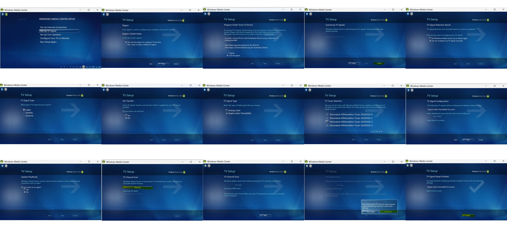

# 🇺🇸 WMC IPTV – US Version



## Modern IPTV for Windows Media Center

**WMC IPTV** brings modern IPTV and live-TV sources directly into the native Windows Media Center Live TV experience using virtual HDHomeRun tuners.

Created and developed by **Boxcar32**.

---
## 📥 Download WMC IPTV – US Version

The WMC IPTV US installer provides the complete setup for integrating IPTV channels into Windows Media Center.

### Current US Build

**157 Channels | Channels 100–256 | 8 Virtual Tuners | EPG123**

> 🚧 **Installer release coming soon.**

The installer and release notes will be available from the **GitHub Releases** section of this repository.

---
## 🇺🇸 US Version

The US configuration has been designed and tested with a **157-channel Windows Media Center lineup**.

### Current Configuration

- 📺 **157 IPTV channels**
- 🔢 WMC channel range: **100–256**
- 📡 **8 virtual HDHomeRun tuners**
- 📖 **EPG123 guide integration**
- 🎮 Full Windows Media Center remote-control experience
- ⏺ Uses WMC's native Live TV and recording system
- 📋 Channels appear directly in the native WMC Guide

From Windows Media Center's perspective, the IPTV channels are presented as television channels through the virtual tuner system.

---

## 🌐 Supported Sources

WMC IPTV can integrate user-supplied live-TV sources including:

- **YouTube TV**
- **Frndly TV**
- **Pluto TV**
- Local live streams
- HTTP/HLS streams
- Live webcams
- Other compatible M3U sources

> **WMC IPTV does not provide television subscriptions, accounts, credentials, or unauthorized streams. Users must supply and have permission to access their own sources.**

---

## ⚙️ How It Works

```text
IPTV / Live-TV Sources
          │
          ▼
     WMC IPTV Bridge
          │
          ▼
     HDHRProxyIPTV
          │
          ▼
  8 Virtual HDHomeRun Tuners
          │
          ▼
   Windows Media Center
          │
          ├── Live TV
          ├── WMC Guide
          ├── Recording
          └── Remote Control
```

WMC continues to operate as the television front end while WMC IPTV handles the IPTV-to-WMC bridge.

The result is an IPTV system that behaves like traditional television inside Windows Media Center.

---

## 📺 Native Windows Media Center Experience

Once configured, IPTV channels appear directly inside Windows Media Center.

You can use the familiar WMC interface for:

- Live TV
- Channel changing
- Program Guide
- Remote control
- Recording
- Scheduled recordings
- Multiple simultaneous tuners

No separate IPTV player is required for normal WMC operation.

---

## 📖 EPG123 Program Guide

WMC IPTV integrates with **EPG123** for Windows Media Center guide data.

IPTV channels can be matched with EPG123 listings so they appear in the familiar WMC television guide with program information.

This preserves the classic Windows Media Center guide experience while using modern live-TV sources.

---

## 📡 Virtual Tuners

The current US configuration provides:

**8 Virtual HDHomeRun Tuners**

Windows Media Center sees these as television tuners and uses its normal tuner-management system for Live TV and recordings.

This allows multiple channels to be accessed simultaneously, subject to the capabilities and restrictions of the user's source services.

---

## 🔢 US Channel Lineup

The current US build supports:

**157 Channels**

WMC channel numbers:

**100–256**

The installer builds the channel mapping and integrates the lineup with Windows Media Center.

---

## 🖥️ Tested Environment

The current US version has been developed and tested with:

- Windows 11
- GaRyan2 Windows Media Center
- HDHRProxyIPTV
- EPG123
- WMC IPTV US configuration
- 157-channel lineup
- 8 virtual tuners

---

## 📘 Installation & Documentation

See the included:

**WMC IPTV User Manual.pdf**

for information about:

- Installation requirements
- M3U preparation
- IPTV source configuration
- Windows Media Center TV setup
- Channel installation
- EPG123 guide matching
- Starting and using WMC IPTV

---

## 📸 Screenshots

Screenshots of the **WMC IPTV – US Version** running inside Windows Media Center will showcase:

- WMC Guide with IPTV channels
- Channels 100–256
- EPG123 program information
- Live IPTV playback inside WMC
- US television lineup
- WMC remote-control operation
- Virtual tuner configuration
- WMC IPTV installer

---

## ⚠️ Requirements

Windows Media Center and the required HDHomeRun/BDA environment must be installed and configured before completing WMC IPTV channel installation.

Users must provide their own compatible M3U configuration and legitimate access to any television services or streams used with WMC IPTV.

WMC IPTV does not provide subscription television services or bypass provider authentication.

---

## 🚧 Project Status

**WMC IPTV – US Version is under active development.**

### Current US Build

**157 Channels • Channels 100–256 • 8 Virtual Tuners • EPG123**

Additional improvements, documentation, compatibility testing, and installer development are ongoing.

---

## 🇺🇸 WMC Lives On

**WMC IPTV** is designed to keep the classic Windows Media Center television experience useful with modern live-TV sources.

The goal is to preserve what made Windows Media Center great:

**Live TV • Guide • Recording • Remote Control • 10-Foot TV Interface**

while providing a bridge to modern IPTV and streaming sources.

---

### WMC IPTV – US Version

**157 Channels | 100–256 | 8 Virtual Tuners | EPG123**

Created by **Boxcar32**
